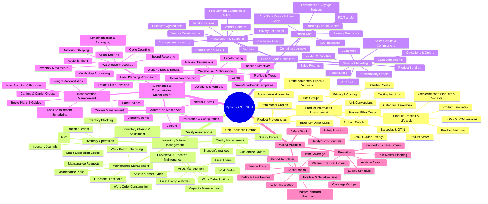

# Supply Chain

```mermaid
mindmap
  root((Dynamics 365 SCM))

    Product Information Management
      Product Creation & Lifecycle
        Create/Release Products & Variants
        Product Templates
        BOMs & BOM Versions
        Category Hierarchies
        Product States
        Product Attributes
      Product Prerequisites
        Inventory Dimensions
        Item Model Groups
        Reservation Hierarchies
        Unit Sequence Groups
      Product Details
        Barcodes & GTIN
        Unit Conversions
        Default Order Settings
        Product Filter Codes
      Pricing & Costing
        Costing Versions
        Price Groups
        Standard Costs
        Trade Agreement Prices & Discounts

    Inventory & Asset Management
      Inventory Operations
        Inventory Journals
        Transfer Orders
        Inventory Closing & Adjustment
        Inventory Blocking
        Batch Disposition Codes
        Inventory Reports (ABC)
      Quality Management
        Nonconformances
        Quality Associations
        Quality Orders
        Quarantine Orders
      Asset Management
        Work Orders
        Assets & Asset Types
        Capacity Management
        Work Order Settings
        Preventive & Reactive Maintenance
        Asset Loans
        Asset Lifecycle Models
      Maintenance Management
        Maintenance Plans
        Functional Locations
        Maintenance Requests
        Work Order Consumption
        Work Order Scheduling

    Supply Chain Processes
      Procurement & Sourcing
        Vendors
        Requisitions & RFQs
        Purchase Orders
        Purchase Agreements
        Vendor Rebates
        Consignment Inventory
        Delivery Schedules
        Procurement Categories & Policies
        Vendor Collaboration
        Vendor Returns
      Landed Cost
        Parameters & Voyage Statuses
        Voyages (PO/Transfer)
        Cost Estimation
        Tracking Control Center
        Journey Templates
        Cost Type Codes & Auto-Costs
        Container Journeys
      Sales & Marketing
        Customers
        Sales Agreements
        Quotations & Orders
        Reservations
        Sales Returns
        Sales Groups & Commissions
        Intercompany Orders
        Customer Rebates
        ATP / CTP
        Product Bundles

    Warehouse & Transportation Management
      Warehouse Configuration
        Sites & Warehouses
        Locations & Formats
        Profiles & Types
        Zones
        Work Policies & Breaks
        Location Directives
        Wave/Load/Work Templates
        Label Printing
        Packing Dimensions
      Warehouse Processes
        Inbound Receiving
        Outbound Shipping
        Replenishment
        Load Planning Workbench
        Inventory Movements
        Cycle Counting
        Mobile App Processing
        Containerization & Packaging
        Cross Docking
      Transportation Management
        Carriers & Carrier Groups
        Load Planning & Execution
        Freight Bills & Invoices
        Route Plans & Guides
        Rate Engines
        Dock Appointment Scheduling
        Freight Reconciliation
      Warehouse Mobile App
        Menus & Items
        Display Settings
        Detours
        Installation & Configuration
        Worker Management

    Master Planning
      Configuration
        Coverage Groups
        Item Coverage
        Master Planning Parameters
        Master Plans
        Positive & Negative Days
        Action Messages
        Delay & Time Fences
        Period Templates
      Execution
        Run Master Planning
        Analyze Results
        Planned Purchase Orders
        Planned Transfer Orders
        Supply Schedule
      Safety Stock
        Safety Margins
        Safety Stock Journals
```
