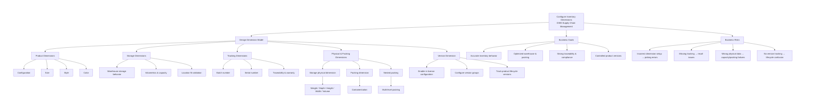

# Inventory Management Diagrams

## Inventory Dimensions

```mermaid
%%{init: { 'flowchart': { 'diagramPadding': 100 } }}%%
flowchart TD
    A[Configure Inventory Dimensions<br/>D365 Supply Chain Management] --> B[Design Dimension Model]
    B --> C[Product Dimensions]
    B --> D[Storage Dimensions]
    B --> E[Tracking Dimensions]
    B --> F[Physical & Packing Dimensions]
    B --> G[Version Dimension]

    %% Product dimensions
    C --> C1[Configuration]
    C --> C2[Size]
    C --> C3[Style]
    C --> C4[Color]

    %% Storage dimensions
    D --> D1[Warehouse storage behavior]
    D --> D2[Volumetrics & capacity]
    D --> D3[Location fit validation]

    %% Tracking dimensions
    E --> E1[Batch number]
    E --> E2[Serial number]
    E --> E3[Traceability & warranty]

    %% Physical & packing
    F --> F1[Storage physical dimension]
    F --> F2[Packing dimension]
    F --> F3[Nested packing]
    F1 --> F11[Weight / Depth / Height / Width / Volume]
    F2 --> F21[Containerization]
    F3 --> F31[Multi‑level packing]

    %% Version dimension
    G --> G1[Enable in license configuration]
    G --> G2[Configure version groups]
    G --> G3[Track product lifecycle versions]

    %% Business goals
    A --> H[Business Goals]
    H --> H1[Accurate inventory behavior]
    H --> H2[Optimized warehouse & packing]
    H --> H3[Strong traceability & compliance]
    H --> H4[Controlled product versions]

    %% Business risks
    A --> I[Business Risks]
    I --> I1[Incorrect dimension setup → picking errors]
    I --> I2[Missing tracking → recall issues]
    I --> I3[Wrong physical data → capacity/packing failures]
    I --> I4[No version tracking → lifecycle confusion]

```
