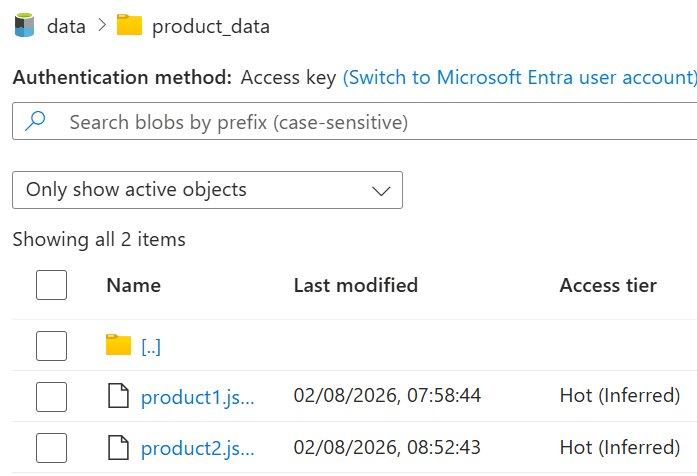
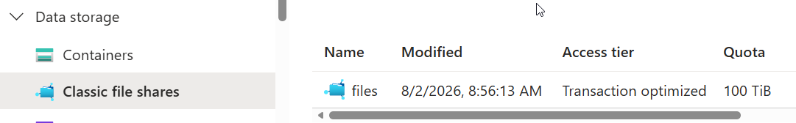

# Exercise 00 - Azure Data Fundamentals

## Objective

Learn the foundational concepts of Azure data services and gain hands-on experience with:

- Relational data
- Non-relational data
- Analytics workloads
- Microsoft Fabric fundamentals

Aligned with the DP-900 Azure Data Fundamentals certification.

---

## Prerequisites

- Microsoft Azure account
- Microsoft Fabric trial (optional)
- Web browser
- Basic understanding of cloud concepts

---

## Lab Azure Storage

Create an Azure Storage account, which is a secure place in the cloud to keep different kinds of data. You’ll then explore its four core services and see what each one is for:

- Blob storage, for storing files such as images, documents, and data files.
- Data Lake Storage Gen2, blob storage with real folders, used for big-data analytics.
- Azure Files, cloud file shares that behave like a shared network drive.

---

## Tasks

### Task 1: [Explore Azure Storage](https://microsoftlearning.github.io/DP-900T00A-Azure-Data-Fundamentals/Instructions/Labs/dp900-02-storage-lab.html)

- Create a storage account
- Upload product1.json to virtual folder product_data.
- Data Lake Gen2 upgrade.
- Upload product2.json. Adding a second file post-upgrade confirms seamless continuity: existing blobs still work, and new ones gain hierarchical benefits such as directory ACLs (Access Control Lists). 
   
- Add a Classic file shares 
  
- Cleanup
